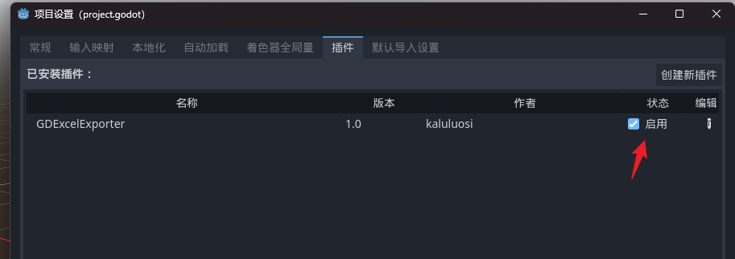

# GDExcelExporter-Plugin for Godot 4.0

Godot版本：4.0

这个插件需要GDExcelExporter支持
https://github.com/kaluluosi/GDExcelExporter

GDExcelExporter插件，用来在Godot里面调用ee命令导出项目里的表,这样就不用切换配置表目录那么麻烦。

## 安装

由于这个插件是为 `GDExcelExporter` 服务的，所以我没有发布到官方商店里。

你可以直接下载这个插件的压缩包，然后放到Godot的项目目录里。

或者用`AssetLib`的导入功能将压缩包导入这个zip压缩包。

然后到 `项目设置>插件>激活插件`。

## 使用流程

1. 先去项目设置>GDExcelExporter/settings_dir 里设置你配置表项目目录路径
2. 再去项目设置>GDExcelExporter/ee_path 里设置你的ee命令路径，如果是用pip装的你不用设置，如果是用的ee.exe就设置成这个exe的路径

有两个地方可以触发一键导出
项目>工具>ExcelExport  导出目录中的Excel表"

右上角的工具按钮

